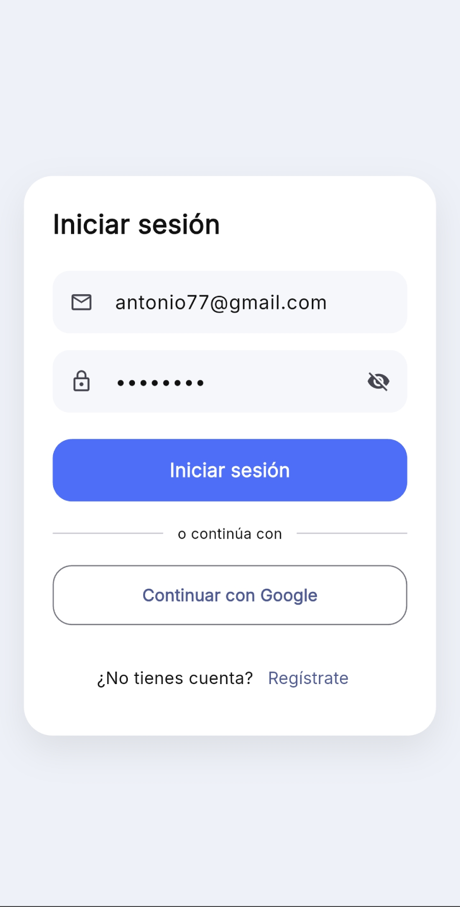
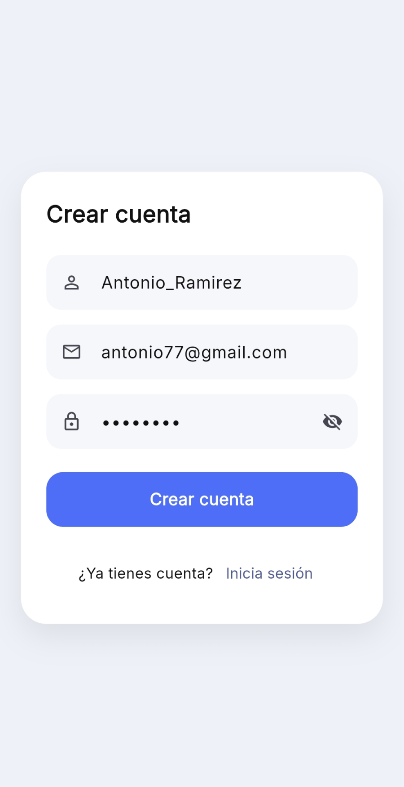
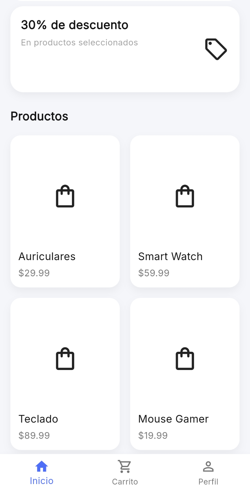
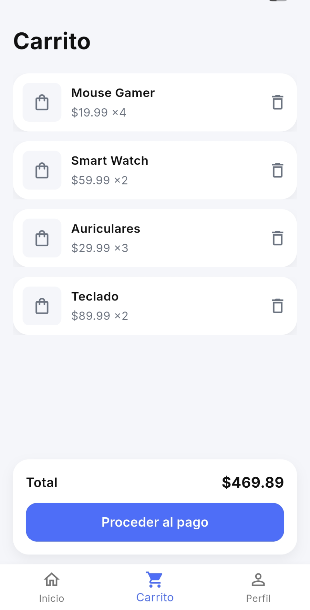
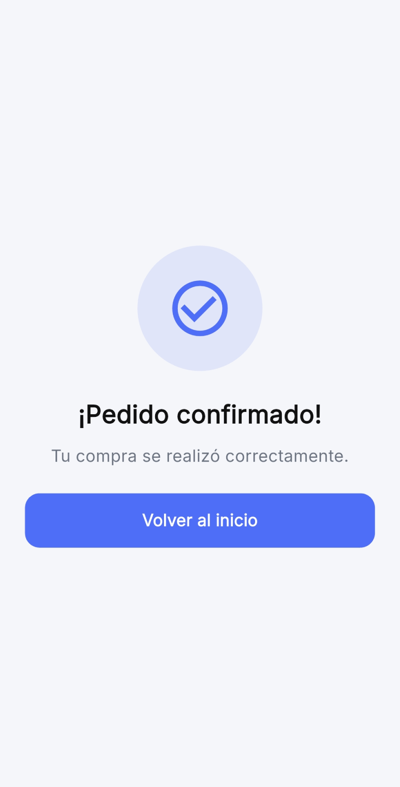
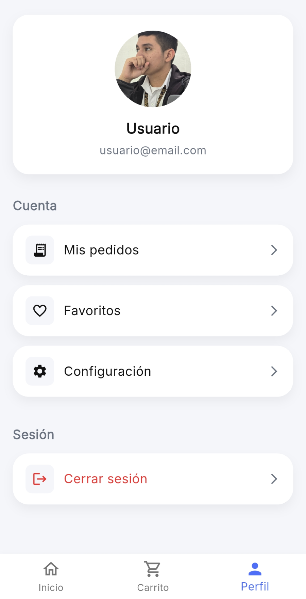

# Carto – Flutter Shopping App

## Descripción
Carto es un prototipo de aplicación de compras desarrollado con Flutter, enfocado en el diseño de interfaces (UI), la experiencia de usuario (UX) y una arquitectura limpia y escalable. Su diseño prioriza la claridad visual, la jerarquía de la información y la simplicidad en las interacciones, evitando la sobrecarga cognitiva del usuario.

El proyecto simula el flujo principal de una aplicación de e-commerce: exploración de productos, carrito de compras, proceso de pedido y perfil de usuario. No cuenta con un backend real; los datos son locales o simulados con fines educativos.

Carto fue concebido como una base visual y estructural sólida, preparada para crecer en el futuro con autenticación, backend y persistencia remota, sin necesidad de rehacer la interfaz ni la lógica principal.

---

## Screenshots

| Login                         | Sign Up                        | Home                         |
| ----------------------------- | ------------------------------ | ---------------------------- |
|  |  |  |

| Cart                         | Order Confirmed                         | Profile                         |
| ---------------------------- | --------------------------------------- | ------------------------------- |
|  |  |  |

---

## Objetivo del proyecto

El objetivo principal de Carto es servir como un proyecto de práctica y demostración enfocado en el diseño de interfaces, experiencia de usuario y arquitectura básica en Flutter.

A través de este proyecto se busca:

- Aplicar principios de **diseño UI/UX** como jerarquía visual, espaciado consistente, contraste, legibilidad y claridad en los flujos.
- Simular el **flujo principal de una aplicación de e-commerce**, desde la selección de productos hasta la confirmación de un pedido.
- Practicar una **estructura de proyecto limpia y escalable**, separando responsabilidades entre pantallas, providers, modelos y widgets reutilizables.
- Utilizar **manejo de estado simple con Provider**, evitando complejidad innecesaria y manteniendo el código fácil de entender.
- Implementar **persistencia local básica** para datos de usuario (avatar, nombre y correo) como introducción a la gestión de estado persistente.
- Construir una base sólida que pueda evolucionar en el futuro hacia una aplicación real implementando backend, autenticación y pagos.

El proyecto prioriza la claridad del código, la experiencia del usuario y la mantenibilidad por encima de la cantidad de funcionalidades.

---

## Decisiones de diseño y experiencia de usuario (UI/UX)

El diseño de **Carto** se fundamenta en la simplicidad, la claridad y la coherencia visual. Cada decisión de interfaz fue tomada de manera intencional para facilitar la comprensión de la aplicación, reducir la carga cognitiva del usuario y priorizar una experiencia de uso fluida.

### Diseño simple e intencional

La aplicación presenta una interfaz visualmente sencilla, evitando elementos decorativos sin una función clara. Esto permite que el usuario se concentre en las acciones principales, como explorar productos, gestionar el carrito y completar un pedido, sin distracciones innecesarias.

La simplicidad no responde a una limitación técnica, sino a una decisión consciente orientada a la usabilidad y a la escalabilidad futura del proyecto.

### Jerarquía visual clara

Carto utiliza una jerarquía visual bien definida mediante:

- Variaciones de tamaño de texto  
- Diferentes pesos tipográficos  
- Espaciados consistentes  
- Separación clara entre secciones  

Esta estructura permite identificar rápidamente la información más relevante en cada pantalla, mejorando la lectura y reduciendo el esfuerzo cognitivo.

### Uso controlado del color

La paleta de colores es reducida y consistente en toda la aplicación. El color se utiliza de forma funcional para:

- Resaltar acciones primarias  
- Indicar estados importantes  
- Diferenciar fondo y superficies  

El uso moderado del color evita distracciones, mejora la accesibilidad y refuerza la identidad visual del proyecto.

### Flujo de navegación lineal y predecible

El flujo de navegación es intencionalmente simple y lineal:

Inicio → Productos → Carrito → Checkout → Confirmación  

Este enfoque facilita la comprensión del recorrido del usuario y asegura que cada pantalla tenga un propósito claro, sin introducir rutas complejas ni comportamientos inesperados.

### Espaciado y consistencia visual

Se mantiene un sistema de espaciado coherente (8, 12, 16, 24 y 32 px), lo que genera una interfaz ordenada y visualmente equilibrada. La consistencia en márgenes, paddings y tamaños de componentes refuerza la sensación de calidad y control visual.

### Feedback visual y estados

La aplicación proporciona retroalimentación visual en acciones clave, como:

- Indicadores de carga durante procesos importantes  
- Pantallas de confirmación claras  
- Estados vacíos informativos  

Esto permite que el usuario comprenda qué está ocurriendo en cada momento y refuerza la confianza en la aplicación.

### Enfoque en experiencia antes que funcionalidad avanzada

Carto prioriza una experiencia de usuario clara y comprensible antes que la incorporación de funcionalidades avanzadas. Esta decisión permite construir una base sólida sobre la cual se pueden añadir futuras mejoras sin comprometer la calidad del diseño ni la mantenibilidad del código.

## Arquitectura y estructura del proyecto

La arquitectura de **Carto** fue diseñada para mantener el código organizado, legible y fácil de escalar. Aunque el proyecto no incluye un backend real, se adoptaron buenas prácticas desde el inicio para simular la estructura de una aplicación de producción.

### Separación de responsabilidades

El proyecto está organizado en capas claras, donde cada una cumple una función específica:

- **Screens**: contienen la lógica de presentación y navegación.
- **Providers**: gestionan el estado y la lógica de negocio.
- **Models**: definen las estructuras de datos.
- **Widgets**: encapsulan componentes reutilizables.
- **UI / Design tokens**: centralizan colores, tipografías y valores visuales.

Esta separación evita archivos sobrecargados, facilita el mantenimiento y permite que el proyecto crezca de forma controlada.

### Manejo de estado con Provider

Se utiliza **Provider** como solución de manejo de estado por ser una alternativa ligera, clara y bien integrada con Flutter:

- Fácil de entender y mantener  
- Evita dependencias innecesarias  
- Permite separar la UI de la lógica de negocio  

El estado de la aplicación (carrito, pedidos y perfil) se gestiona de forma centralizada, haciendo que las pantallas sean más limpias, predecibles y fáciles de probar.

### Flujo de datos claro y controlado

El flujo de datos sigue un patrón unidireccional:

UI → Provider → Actualización de estado → UI

Este enfoque permite:

- Reducir efectos secundarios inesperados  
- Facilitar la depuración  
- Mantener un comportamiento consistente en toda la aplicación  

### Widgets reutilizables

Se priorizó la creación de widgets reutilizables para:

- Reducir la duplicación de código  
- Mantener coherencia visual  
- Facilitar cambios globales de diseño  

Componentes como tarjetas, encabezados, secciones y elementos de lista comparten estilos y comportamientos comunes.

### Persistencia local sin backend

Aunque no existe un backend, se implementó persistencia local para simular el comportamiento de una aplicación real:

- Avatar de perfil  
- Información básica del usuario  
- Estado visual relevante  

Esto permite conservar información entre sesiones y refuerza la sensación de una app funcional.

### Preparada para escalar

La estructura actual permite incorporar en el futuro:

- Autenticación real  
- Backend y base de datos  
- Pagos  
- APIs externas  
- Validaciones avanzadas  

Sin necesidad de rehacer la base del proyecto.

La arquitectura está pensada no solo para que la aplicación funcione hoy, sino para que pueda evolucionar manteniendo la calidad del código y la claridad estructural.

## Manejo del estado y lógica de negocio

El manejo del estado en **Carto** fue diseñado para mantener las pantallas lo más limpias posible y separar de forma clara la lógica de negocio de la interfaz de usuario.

En lugar de gestionar datos directamente dentro de los widgets, se utiliza **Provider** junto con clases `ChangeNotifier`, lo que permite una arquitectura más predecible, organizada y fácil de mantener.

### Principios aplicados

- La UI solo **consume estado**, no lo controla  
- La lógica de negocio vive fuera de las pantallas  
- Los cambios de estado notifican automáticamente a la interfaz  
- El código es más legible, reutilizable y fácil de probar  

### CartProvider

`CartProvider` se encarga exclusivamente de la lógica relacionada con el carrito de compras.

Responsabilidades principales:

- Almacenar la lista de productos añadidos  
- Controlar cantidades y eliminaciones  
- Calcular el total del carrito  
- Notificar cambios a la UI  

Gracias a esto, pantallas como `CartScreen` y `CheckoutScreen` se limitan a renderizar información, sin conocer cómo se gestiona o calcula el estado internamente.

### OrderProvider

`OrderProvider` simula el flujo de pedidos de una aplicación real.

Sus responsabilidades incluyen:

- Registrar pedidos confirmados  
- Almacenar información como total y fecha  
- Permitir la visualización de pedidos en la interfaz  

Aunque no existe un backend, este provider representa la capa que en una aplicación real estaría conectada a servicios remotos o APIs.

### ProfileProvider

`ProfileProvider` gestiona la información básica del perfil del usuario.

Incluye:

- Imagen de perfil  
- Nombre del usuario  
- Correo electrónico  
- Persistencia local de datos  

La información se almacena localmente para mantener el estado entre sesiones, simulando una experiencia cercana a una aplicación real sin depender de un backend.

### Comunicación UI ↔ Estado

Las pantallas interactúan con el estado utilizando:

- `context.watch<T>()` para reaccionar a cambios  
- `context.read<T>()` para ejecutar acciones  

Este enfoque evita reconstrucciones innecesarias y mantiene un flujo de datos claro y controlado.

### Beneficios de este enfoque

- Código más limpio y organizado  
- Menor acoplamiento entre UI y lógica  
- Mayor facilidad de escalado  
- Mejor mantenimiento a largo plazo  
- Comportamiento consistente en toda la aplicación  

El manejo del estado en **Carto** no está pensado solo para funcionar, sino para ser comprensible, escalable y alineado con buenas prácticas en Flutter.

## Experiencia de usuario (UX) y diseño visual

La interfaz de **Carto** fue diseñada priorizando la claridad, la consistencia visual y la facilidad de uso. Cada pantalla y componente está pensado para reducir la carga cognitiva del usuario y guiarlo de forma natural a lo largo de la aplicación.

El diseño no se enfoca únicamente en lo estético, sino en **comunicar de forma clara**, facilitar la toma de decisiones y ofrecer una experiencia fluida y predecible.

### Jerarquía visual

Se aplicó una jerarquía visual clara para resaltar la información más relevante en cada pantalla mediante:

- Títulos con mayor peso visual  
- Información secundaria con menor contraste  
- Acciones principales claramente diferenciadas  
- Uso controlado del color para evitar distracciones  

Esto permite que el usuario identifique rápidamente qué es importante en cada vista y cómo interactuar con ella.

### Espaciado y ritmo visual

Se estableció un sistema de espaciado consistente (8, 12, 16, 24 y 32 px) con el objetivo de:

- Separar secciones de forma clara  
- Evitar interfaces saturadas  
- Mejorar la legibilidad  
- Mantener coherencia entre pantallas  

El uso adecuado del espacio contribuye a una interfaz ordenada, equilibrada y fácil de recorrer visualmente.

### Componentes reutilizables

Se diseñaron componentes visuales reutilizables como:

- Tarjetas  
- Listas  
- Botones  
- Secciones de perfil  

Esto asegura coherencia visual en toda la aplicación, reduce la duplicación de código y facilita la aplicación de cambios globales en el diseño.

### Feedback visual y estados

La aplicación proporciona retroalimentación clara en acciones clave, incluyendo:

- Indicadores de carga durante procesos importantes  
- Estados vacíos cuando no hay contenido disponible  
- Confirmaciones visuales al completar acciones  
- Desactivación de botones cuando una acción no es válida  

Este feedback reduce la incertidumbre del usuario y refuerza la sensación de control y confianza en la aplicación.

### Animaciones y transiciones

Se incorporan animaciones sutiles para:

- Transiciones entre pantallas  
- Aparición progresiva de contenido  
- Estados de carga  

Las animaciones son breves y controladas, aportando fluidez a la experiencia sin distraer ni sobrecargar visualmente al usuario.

### Accesibilidad básica

Se consideraron principios básicos de accesibilidad, tales como:

- Contraste adecuado entre texto y fondo  
- Tamaños de texto legibles  
- Áreas táctiles suficientemente amplias  
- Iconografía clara y reconocible  

Estos aspectos mejoran la usabilidad general y hacen que la aplicación sea más cómoda para distintos tipos de usuarios.

### Enfoque general

Cada decisión de diseño en **Carto** busca equilibrar:

- Estética  
- Usabilidad  
- Claridad  
- Escalabilidad  

El resultado es una interfaz limpia, coherente y preparada para evolucionar hacia una aplicación de producción sin comprometer la experiencia de usuario.

## Persistencia de datos local

**Carto** implementa persistencia de datos local para conservar información relevante del usuario entre sesiones, mejorando la experiencia de uso y reforzando la sensación de continuidad dentro de la aplicación.

Aunque el proyecto no cuenta con un backend, se simula un comportamiento realista mediante almacenamiento local en el dispositivo.

### Información persistida

Actualmente se almacena de forma local:

- Imagen de perfil del usuario  
- Nombre del usuario  
- Correo electrónico  
- Preferencias básicas relacionadas con el perfil  

Esta información se mantiene incluso después de cerrar y volver a abrir la aplicación.

### Implementación

La persistencia se implementa utilizando almacenamiento local del dispositivo, lo que permite:

- Guardar datos simples de forma eficiente  
- Recuperar la información automáticamente al iniciar la aplicación  
- Mantener el estado sincronizado con la interfaz  

El manejo de estos datos se encapsula dentro de un provider dedicado, separando claramente la lógica de negocio de la interfaz de usuario.

### Beneficios para la experiencia de usuario

La persistencia local aporta múltiples beneficios:

- Evita que el usuario tenga que reconfigurar su perfil en cada sesión  
- Refuerza la percepción de una aplicación funcional y consistente  
- Mejora la continuidad de uso  
- Reduce fricción en flujos recurrentes  

### Arquitectura y escalabilidad

La implementación actual está pensada como una base escalable:

- Puede sustituirse fácilmente por una solución conectada a un backend  
- Permite migrar a bases de datos locales más complejas si es necesario  
- Mantiene una estructura limpia, modular y desacoplada  

Esto permite evolucionar el proyecto sin reescribir la interfaz ni afectar la experiencia existente.

### Alcance de la persistencia

La persistencia se limita a información no sensible y de bajo riesgo, adecuada para almacenamiento local. Esto mantiene el proyecto simple, seguro y enfocado en el aprendizaje, el diseño de interfaces y la experiencia de usuario.

## Estado actual del proyecto

Carto se encuentra en una etapa funcional y estable a nivel de interfaz y experiencia de usuario. Todas las pantallas principales están implementadas y los flujos clave de una aplicación de compras pueden recorrerse sin errores críticos.

El proyecto cumple su objetivo principal: servir como base sólida de UI y arquitectura para una aplicación de e-commerce desarrollada en Flutter.

### Nivel de completitud

Actualmente, el proyecto cuenta con:

- Interfaz completamente navegable
- Flujos principales bien definidos
- Manejo de estado centralizado
- Persistencia local para datos básicos
- Diseño visual consistente y coherente

La aplicación puede considerarse **lista como prototipo funcional**.

### Estabilidad

El código se mantiene estable y organizado:

- No existen dependencias innecesarias
- La estructura del proyecto es clara y mantenible
- Los providers están correctamente desacoplados de la UI
- La navegación está controlada y predecible

Esto permite continuar el desarrollo sin deuda técnica significativa.

### Enfoque actual

El enfoque del proyecto está claramente definido en:

- Experiencia de usuario
- Jerarquía visual
- Organización del código
- Buenas prácticas en Flutter
- Simulación realista de una app de compras

Se evita intencionalmente la complejidad de backend para mantener el foco en diseño y arquitectura.

### Uso recomendado

Carto es ideal para:

- Práctica de diseño de interfaces en Flutter
- Referencia de estructura de proyecto
- Base para escalar a un proyecto real
- Presentación como proyecto académico o portafolio

### Limitaciones conocidas

Al tratarse de un proyecto sin backend, existen limitaciones deliberadas:

- Los datos no se sincronizan entre dispositivos
- No hay autenticación real
- No existe validación remota
- Los flujos están simulados

Estas limitaciones son conscientes y forman parte del alcance definido.

---

En su estado actual, Carto representa un proyecto bien planteado, enfocado y listo para evolucionar según las necesidades futuras.

## Trabajo futuro y mejoras posibles

Carto ha sido diseñado desde el inicio con una arquitectura flexible que permite su evolución progresiva. Aunque actualmente se asume como un prototipo funcional de interfaz, existen múltiples líneas de mejora que pueden implementarse sin necesidad de reestructurar el proyecto.

### Integración de backend

Una de las principales evoluciones del proyecto sería la integración de un backend real, lo que permitiría:

- Autenticación de usuarios
- Gestión real de perfiles
- Persistencia de pedidos
- Sincronización de datos entre dispositivos

La estructura actual facilita esta integración gracias al uso de providers y a la separación clara entre lógica y presentación.

### Autenticación y perfiles avanzados

En una etapa futura, el perfil de usuario podría ampliarse para incluir:

- Registro e inicio de sesión
- Edición de nombre y correo electrónico
- Imagen de perfil sincronizada
- Historial de pedidos asociado al usuario

Actualmente, el perfil funciona de manera local como demostración de experiencia de usuario, sirviendo como base para una implementación más compleja.

### Persistencia y almacenamiento

Aunque ya existe persistencia local para ciertos datos, se podrían explorar mejoras como:

- Base de datos local más robusta
- Caché avanzada de productos
- Manejo de sesiones persistentes
- Sincronización offline/online

Estas mejoras permitirían una experiencia más cercana a una aplicación de producción.

## Seguridad (Análisis Estático)

El APK de **release** fue analizado utilizando **MobSF (Mobile Security Framework)** como ejercicio de concienciación en seguridad móvil.

- Se realizó un análisis estático sobre la versión de lanzamiento
- No se detectaron vulnerabilidades críticas
- El análisis se ejecutó sobre el build de producción (release APK)

📄 [MobSF Static Analysis Report](docs/mobsf-report/Carto-v0.1.0-MobSF-Report.pdf)

> **Nota:** Carto es un prototipo enfocado en UI/UX. No incluye backend ni manejo de datos sensibles.

### Mejoras visuales y de experiencia de usuario

El diseño puede seguir evolucionando mediante:

- Uso de ilustraciones SVG personalizadas
- Microinteracciones adicionales
- Animaciones contextuales más refinadas
- Estados vacíos y de error más expresivos

El enfoque seguiría siendo mantener un balance entre estética y usabilidad.

### Pruebas y calidad de código

Otra mejora relevante sería la incorporación de:

- Pruebas unitarias para providers
- Pruebas de widgets para pantallas clave
- Validación de flujos críticos

Esto aumentaría la confiabilidad del proyecto y lo acercaría a estándares profesionales.

## Download
You can download the latest APK from the Releases section.

### Escalabilidad del proyecto

Gracias a la estructura actual, Carto puede escalar sin fricción hacia:

- Nuevos módulos
- Más pantallas
- Nuevos flujos de usuario
- Integración con servicios externos

---
