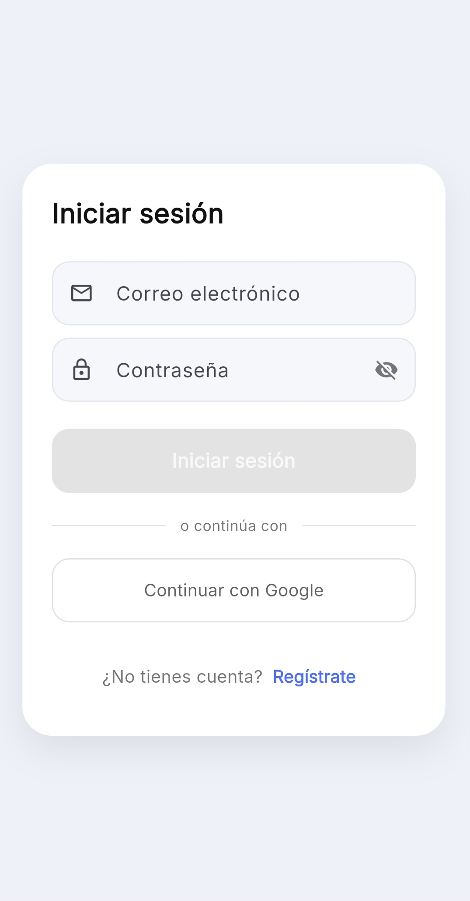
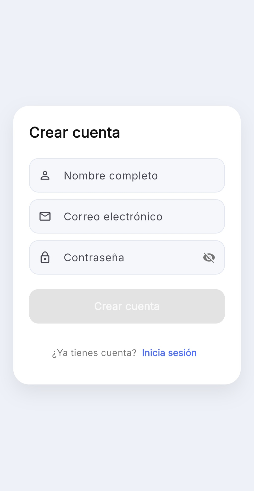
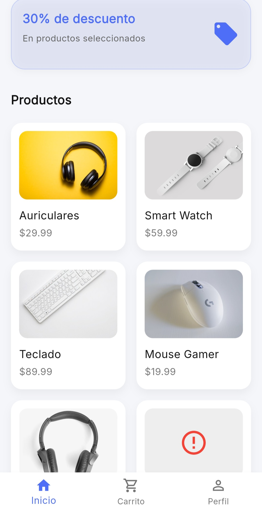
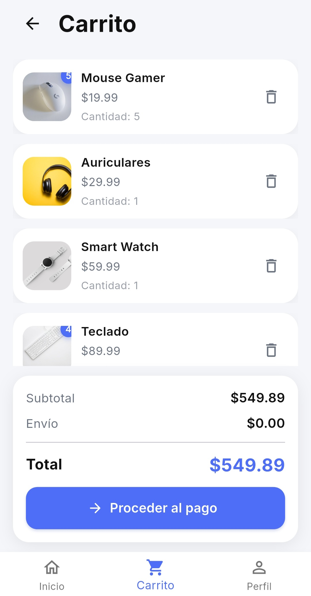
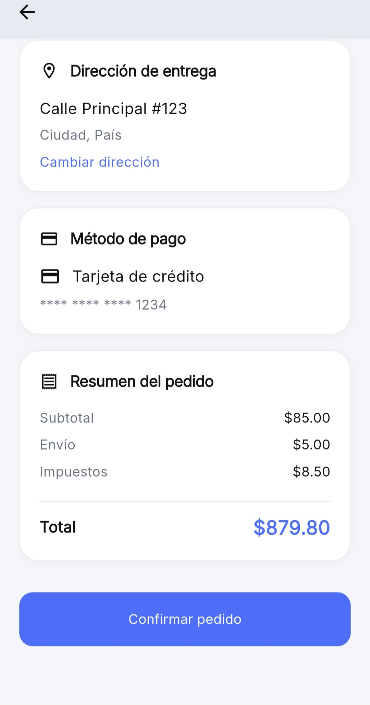
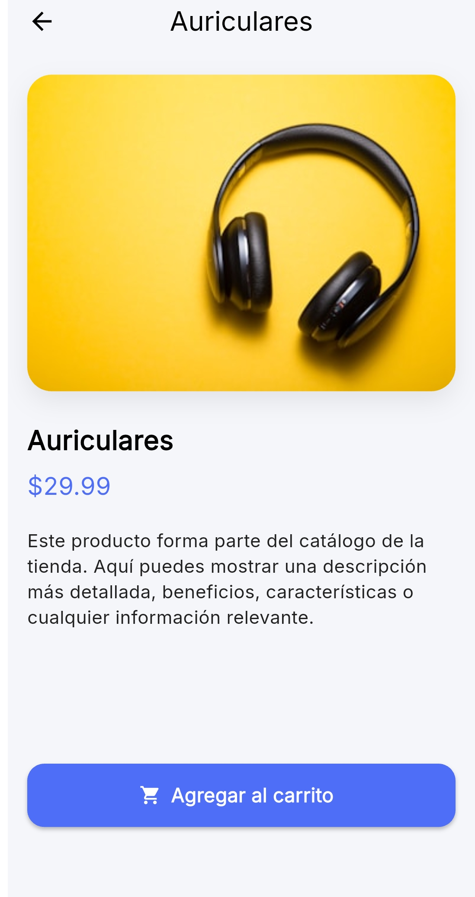
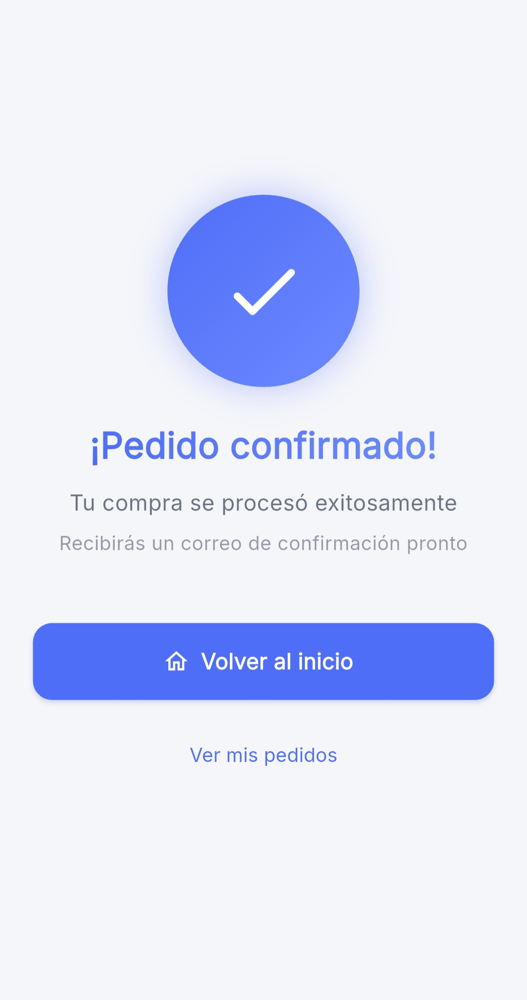
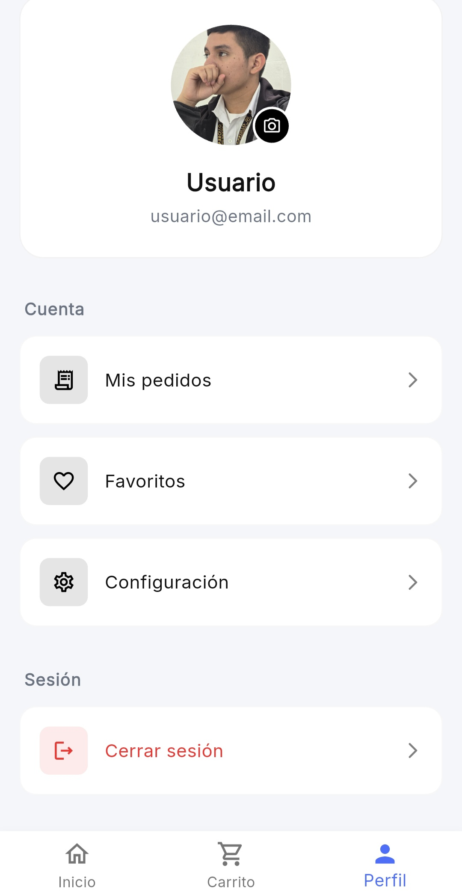
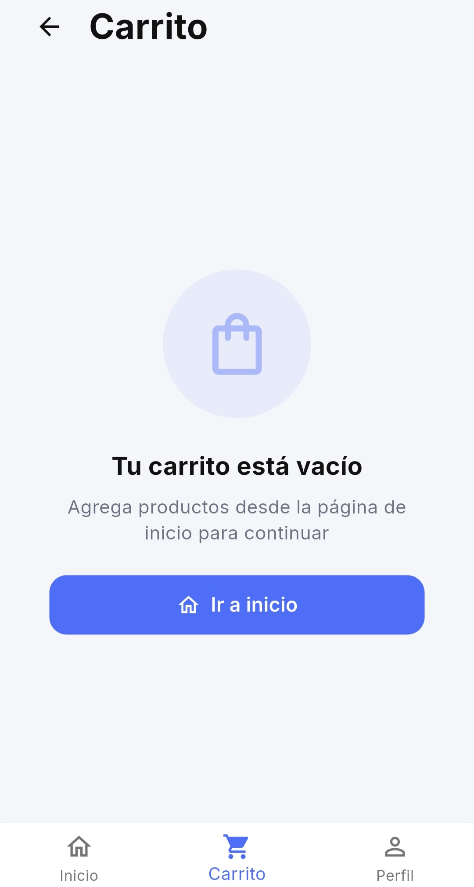

# Carto – Flutter Shopping App

## Descripción

Carto es un prototipo de aplicación de compras desarrollado con **Flutter**, enfocado en la experiencia de usuario (**UX/UI**) y una arquitectura clara y mantenible. El proyecto prioriza la simplicidad, la coherencia visual y la separación de responsabilidades, evitando complejidad innecesaria.

Simula el flujo principal de una aplicación de **e-commerce**: exploración de productos, carrito de compras, checkout, confirmación de pedidos y perfil de usuario. No cuenta con un backend real; los datos se gestionan de forma local con fines educativos y de demostración.

Carto fue concebido como una **base sólida y escalable**, preparada para integrar autenticación, backend y persistencia remota sin necesidad de reescribir la interfaz ni la lógica principal.

---

## Screenshots

  <table>
    <tr>
      <td align="center"><strong>Login</strong> </td>
      <td align="center"><strong>Sign Up</strong> </td>
      <td align="center"><strong>Home</strong> </td>
    </tr>
    <tr>
      <td align="center"><strong>Cart</strong> </td>
      <td align="center"><strong>Checkout</strong> </td>
      <td align="center"><strong>Product Detail</strong> </td>
    </tr>
    <tr>
      <td align="center"><strong>Order Confirmed</strong> </td>
      <td align="center"><strong>Profile</strong> </td>
      <td align="center"><strong>Empty Cart</strong> </td>
    </tr>
  </table>

---

## Objetivo del proyecto

El objetivo principal de Carto es servir como un proyecto de práctica y demostración enfocado en:

- Diseño de interfaces y experiencia de usuario (**UX/UI**)
- Buenas prácticas de desarrollo en Flutter
- Arquitectura limpia y escalable
- Manejo de estado claro y predecible

El proyecto prioriza claridad, mantenibilidad y experiencia de usuario por encima de la cantidad de funcionalidades.

---

## Arquitectura y manejo de estado

Carto utiliza una arquitectura organizada por responsabilidades claras:

- **Screens**: vistas y navegación  
- **Providers**: estado y lógica de negocio  
- **Models**: estructuras de datos  
- **Widgets**: componentes reutilizables  
- **UI**: estilos, colores y tokens visuales  

El manejo de estado se realiza con **Provider** y `ChangeNotifier`, siguiendo un flujo de datos unidireccional:

UI → Provider → Actualización de estado → UI

Este enfoque mantiene las pantallas limpias, reduce el acoplamiento y facilita el mantenimiento y escalado del proyecto.

---

## Experiencia de usuario (UX/UI)

El diseño de Carto se basa en principios de simplicidad, claridad visual y consistencia:

- Jerarquía visual clara  
- Espaciado consistente  
- Uso controlado del color  
- Componentes reutilizables  
- Feedback visual en acciones clave  

La interfaz está pensada para reducir la carga cognitiva y guiar al usuario de forma natural a través de los flujos principales.

---

## Persistencia local

Aunque no existe un backend real, Carto implementa **persistencia local** para simular el comportamiento de una aplicación funcional:

- Información básica del perfil  
- Estado visual relevante  

Esto permite conservar datos entre sesiones y refuerza la sensación de continuidad sin introducir complejidad innecesaria.

---

## Estado actual del proyecto

- Interfaz completamente navegable  
- Flujos principales implementados  
- Manejo de estado centralizado  
- Diseño visual consistente  

Carto puede considerarse **un prototipo funcional estable**, listo para evolucionar hacia una aplicación de producción.

---

## Trabajo futuro

La arquitectura actual permite integrar fácilmente:

- Backend y autenticación real  
- Persistencia remota y sincronización  
- Pruebas unitarias y de widgets  
- Mejoras visuales y microinteracciones  

---

## Seguridad

El APK de **release** fue analizado con **MobSF (Mobile Security Framework)** como ejercicio de concienciación en seguridad móvil.

📄 [MobSF Static Analysis Report](docs/mobsf-report/Carto-v0.1.0-MobSF-Report.pdf)

> Carto es un prototipo enfocado en UI/UX y no maneja datos sensibles.

---

## Download

You can download the latest APK from the **Releases** section.

## License

This project is licensed under the MIT License.
See the [LICENSE](LICENSE) file for details.

Este proyecto está en constante evolución.
Siempre agradecemos tus comentarios, incidencias y ⭐.
